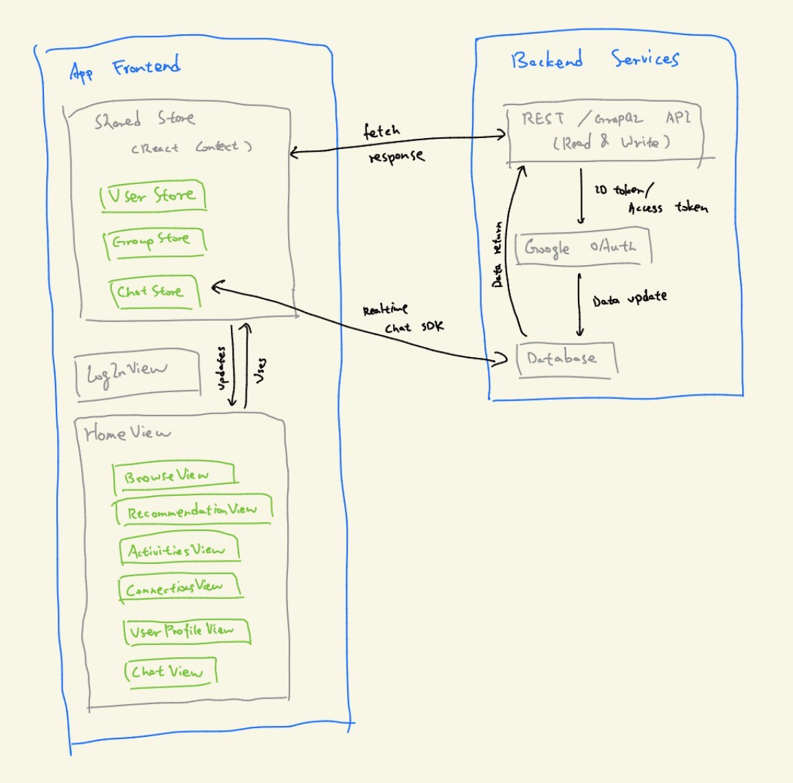

# CSE403-GoBuddy

## 1) Team Info

### Team roster & roles

| Member | Role Focus | Notes |
| -- | -- | -- |
| Aaryan Jain (@Ashuchamp, `aaryaj@uw.edu`) | Backend / API Design | Database and authentication lead; responsible for API structure and endpoint consistency. |
| Kehan Jin (@Jinkehan, `jinkehan@uw.edu`) | Backend / Search Logic | Implements query optimization and user-matching logic for efficient discovery. |
| Ray Xu (@iurux, `rayxr@uw.edu`) | Frontend / UI Development | Focuses on state management, component testing, and UI consistency. |
| Ting-Yu Hsu (@alisa01-ali, `tingyu01@uw.edu`) | UI / Design Integration | Converts Figma mockups into React Native components; ensures design fidelity. |
| Sophia Su (@SuJning, `sjn0305@uw.edu`) | Frontend / Integration | React Native lead; oversees QA testing and ensures smooth view integration. |
| Ian Matthew Lua (@Dev1cey, `luam@uw.edu`) | Full-Stack / Testing | Handles CI/CD setup, documentation, and end-to-end testing workflows. |

### Project artifacts (links)

* **GitHub repo (public):** `https://github.com/Ashuchamp/CSE403-GoBuddy`

### Communication & working agreements

* **Synchronous:** Meeting online for a weekly standup (30 mins) and adhoc meetings as needed.
* **Asynchronous:** Text messages for day to day communication and planning things out; Ed for course Q&A.
* **Decision making:** Default to lazy consensus; escalate for critical issues and decisions and full team discussion.
---

## 2) Product Description

### Vision (revised from proposal)

GoBuddy is a campus‑focused mobile app that helps UW students find **activity buddies**—for the gym, sports, studying, gaming, and other hobbies. Profiles emphasize **activity‑based intent** (e.g., “looking for a gym buddy,” “basketball on weekends,” “BIO 180 study partner”). Users verify a `*.uw.edu` email, browse or search by tags/categories, and exchange contact info through a **lightweight in‑app request** flow designed to move matches to real‑world meetups quickly. We will pilot at UW first, with future expansion to additional campuses.

**Problem**
Students often want to try new activities or maintain habits but lack someone to join them. Existing friend‑matching apps are broad, and rarely optimized for concrete, in‑person activity meetups.

**Our differentiation**

* **Activity‑centric profiles & discovery** (clear intent, low social friction).
* **Campus verification** (UW affinity increases trust and relevance).
* **Purposeful request flow** (exchange contact info to move off‑app).
* **Simplicity** (MVP focuses on the core: discover → request → connect).

### Major features (MVP)

1. **UW Identity Verification** — SSO via UW authentication service (no passwords stored by app) or magic‑link flow requiring a `uw.edu` address before profile is visible.
2. **Activity‑centric Profiles** — Bio, skills/experience, preferred times, **activity tags selected from predefined categories** (e.g., `gym`, `soccer`, `BIO 180 study`), and **campus locations chosen from a dropdown list** (e.g., IMA, Odegaard, HUB, Red Square).
3. **Browse & Search** — Filter by predefined tags, categories (sports/study/creative/etc.), time windows, and campus location (selectable from list).
4. **Request to Connect** — In‑app request to exchange contact info (e.g., phone/Instagram). Sender can include a short note; receiver can accept/decline.
5. **Action History** — In‑app log of all actions taken, including connection requests sent/received, contact information exchanges, activity intents posted/modified/deleted, and groups joined/left.
6. **Recommendations** — Simple heuristic or ML‑light suggestions based on tags/time windows.

### Backend implementation and data storage

The app uses a **Node.js + Express** backend with a **Postgres** database managed via **Prisma ORM**. The database stores user profiles (`users` table with UW email, username, bio, verification status), predefined activity tags and locations (`activity_tags`, `locations` tables), user preferences (many-to-many `user_activity_tags` and `user_locations` linking users to their selected tags/locations with skill levels and time preferences), activity intents (`activity_intents` for posted activities), connection requests (`connection_requests` tracking pending/accepted status), contact info (`contact_info` with phone/Instagram, only visible after connection acceptance), action history (`action_history` logging all user interactions), and safety records (`blocks_and_reports`). Key API calls include authentication endpoints (`POST /auth/sso/initiate`, `GET /auth/sso/callback`, magic link endpoints), profile endpoints (`GET /users/me`, `PUT /users/me`), search/discovery (`GET /search` with tag/location/time filters, `GET /recommendations` using tag similarity), connection management (`POST /connections/request`, `POST /connections/:id/respond`, `GET /connections/:user_id/contact`), and activity/history endpoints (`POST /intents`, `GET /intents`, `GET /history`). All endpoints validate JWT tokens for authorization, use Prisma's parameterized queries to prevent SQL injection, and validate inputs with Zod schemas.

### Stretch goals

* **Multi‑campus expansion** — Extend verification to other universities beyond UW.
* **Events & Groups** — Create one‑off activity posts (e.g., "3v3 basketball today at 4pm").
* **Scheduling helpers** — Calendar export or quick‑poll for times.
* **Enhanced Action History** — Export history, search/filter past actions, analytics dashboard.

### Out of scope (for M2–M3)

* Complex geolocation matching or maps.
* Payments/marketplace features.

---

## 3) Use Cases — Functional Requirements

**System‑wide assumptions**

* Users are UW students verified via `uw.edu` email or UW SSO.
* Mobile is primary (React Native); a basic web view may exist for read‑only browsing.
* Contact info exchange happens through a request/accept flow; **no in‑app chat or messaging** — users move to external platforms after connecting.
* All user actions are logged in an **Action History** for transparency and accountability.

### UC‑1: Send request to connect  *(Owner: Aaryan Jain)*

**Actors:** Requester (verified user), Recipient (verified user)  
**Trigger:** Requester taps “Request to connect” on a profile.   
**Preconditions:** Both have verified accounts; requester has an existing profile.   
**Postconditions:** Recipient receives a pending request with optional message.  

**Main flow:**
1. Requester writes an optional note (e.g., “Free M/W mornings at IMA”).
2. System validates request rate limits (spam control) and creates a **Pending** request.
3. Recipient gets an in‑app notification and email summary.

**Extensions:** (a) Withdraw request; (b) Recipient pre‑filters (auto‑ignore certain tags).  
**Exceptions:** (E1) Recipient has blocked requester ⇒ reject with generic failure; (E2) Rate limit exceeded ⇒ ask to try later.  

### UC-2: Create new activity intent  *(Owner: Kehan Jin)*

**Actors:** User (verified user)  
**Trigger:** User fill in info about a new activity intent and post it.    
**Preconditions:** User has verified account with existing profile.    
**Postconditions:** The user has an actility intent associated to their profile and other users can view it.   
**Main flow:**
1. User goes to a create intent page and fill in information about the new intent.
2. User verifies information are correct and post it.
3. Other users can view this new activity intent and connect with the user.  

**Extensions:** (a) Another user views the intent and intend to connect; (b) User decide to delete the activity intent.  
**Exceptions:** (E1) Internet failure while sending message ⇒ ask to try later; (E2) User don't have an existing profile ⇒ direct to profile set up page.

### UC‑3: Create Profile  *(Owner: Ting-Yu Hsu)*

**Actors:** User (verified user)       
**Trigger:** User sign in for the first time to create profile.       
**Preconditions:** User account(uw email) was verified.  
**Postconditions:** Profile data are saved and available to be searched. 

**Main flow:**
1. System navigate to profile creation page after user first sign in.
2. User enter a username, short bio, select activity tags, and upload profile picture.
3. System valiadate input (eg. must have username, other fields can be skipped).
4. System store the new profile in the database.
5. Profile become visible to other users through searching and browsing.

**Extensions:** (a) User later edit profile; (b) User ignore uploading photo (default avatar display).  
**Exceptions:** (E1) Invalid or missing input ⇒ show validation error message; (E2) System unable to save edit profile due to internet connection error ⇒ show save failed message and notice user to try again. 

### UC‑4: Keyword-based activity search  *(Owner: Ray Xu)*

**Actors:** User (verified user).         
**Trigger:** User click in the search field and type the keyword.   
**Preconditions:** User account was verified.   
**Postconditions:** A list of activities that contain the keyword will show up.  

**Main flow:**
1. User click the search field.
2. User type in the keyword. (e.g. user type "hiking")
3. System take in the keyword.
4. System searches through the databased for activities.
5. System returns a list of activities that contain keyword and available for user to view.

**Extensions:** (a) Save activities interested in to user's wishlist; (b) Search activities based on keyword related terms.  
**Exceptions:** (E1) Keyword doesn't exist in the database ⇒ suggest user to create an activity; (E2) Keyword exceeds the available input length ⇒ deny the search and suggest shorten the keyword. 

### UC‑5: Group Activity Formation  *(Owner: Sophia Su)*

**Actors:** Organizor (verified user), Participants (verified user)  
**Trigger:** Organizer converts an individual intent into a group activity.   
**Preconditions:** Organizer has at least one posted intent.
**Postconditions:** The system creates a shared group activity with multiple participants.  

**Main flow:**
1. Organizer selects “Convert to group activity” on an intent.
2. System prompts the organizer to set maximum participants and visibility (public/private).
3. Interested users can join until the group is full.
4. Once full, the system automatically creates a group confirmation summary.

**Extensions:** (a) Organizer can reopen or close the group; (b) Users can leave before event date.
**Exceptions:** (E1) Group reaches full capacity ⇒ show “activity full”; (E2) Organizer cancels ⇒ notify all participants.

### UC‑6: Exchange Contact Info *(Owner: Matthew Lua)*

**Actors:** User (verified & connected user).         
**Trigger:** One user taps “Exchange contact info” after both have accepted a connection request.
**Preconditions:** Both have verified accounts; requester has an existing profile. 
**Postconditions:** Users involved receive the other’s shared contact info, depending on their privacy settings.

**Main flow:**
1. User opens connection detail page.
2. User taps “Exchange contact info.”
3. System verifies connection status and retrieves both users’ contact details.
4. System displays the shared contact info to both users.

**Extensions:** (a) User edits or removes shared info later; (b) User selects which contact method to share.
**Exceptions:** (E1) One user disables sharing -> show "Contact exchange unavailable"; (E2) Network error -> prompt to try again later.

---

## 4) Non‑Functional Requirements

1. **Data Fields & Privacy Levels**

   The app stores and manages user information with the following privacy tiers:

   * **Always Public** (visible to all verified users): Username, profile picture, bio, activity tags, skills/experience level, preferred times, campus locations, activity intents (posted activities), groups/events joined, activity timestamps ("Active 2 days ago" indicators).
   
   * **Private Until Connected**: Contact information (phone number, Instagram handle, etc.) — hidden until connection request is accepted by both parties.
   
   * **Never Shared** (auth & system only): UW email address (authentication only, never displayed), authentication tokens (OAuth/session tokens, securely stored with auto-expiration), verification status, account status (active/suspended/banned), rate limit counters for spam prevention.
   
   * **User-Private**: Action history (log of requests sent/received, contacts exchanged, activities created/joined) — visible only to the user themselves.
   
   * **Admin Only**: Block/report records (for safety and moderation), IP addresses from login events (retained 90 days for security auditing).
   
   * **Visible to Involved Parties**: Connection requests (pending/accepted/declined with timestamps) — only visible to requester and recipient.

2. **Data Retention Policy**

   * **Active accounts:** Data retained indefinitely while account is active.
   * **Deleted accounts:** User data permanently deleted within 30 days of account deletion request; legal/safety records retained per policy.
   * **Inactive accounts:** Accounts inactive for 2+ years receive deletion warning; deleted after 2.5 years.
   * **Action history:** Retained for 1 year, then archived/summarized.

3. **User Control**

   Users can:
   * View all their stored data via "Download My Data" feature.
   * Edit public profile fields at any time.
   * Delete their account and all associated data.
   * Control which contact methods to share after connection acceptance.
   * Block or report other users.

2. **Security & Privacy**

   * UW‑only access: verified via `uw.edu` email or **UW SSO (primary method)**—no passwords stored by the app.
   * **External authentication** via UW Identity Service or OAuth providers (Microsoft 365) handles all credential management.
   * Store only necessary PII; **contact info is hidden** until connection acceptance.
   * Secure token handling: OAuth tokens encrypted at rest, automatic expiration and rotation.
   * Abuse controls: rate limits (per IP & per account), block/report, **content filter for abusive/harassing language** (hate speech, threats, slurs, explicit harassment—not casual profanity).

   **How We Ensure Only UW Students Can Log In:** We primarily use UW's official Single Sign-On (SSO) system, which redirects users to UW's authentication portal (`weblogin.washington.edu`) where they log in with their NetID—only active UW students/staff have valid NetID credentials, so UW verifies their affiliation for us. As a fallback, we offer magic links sent to `@uw.edu` email addresses (domain validated before sending), which proves the user controls a UW email that only UW issues to affiliates. All user records require `verification_status = 'verified'` before their profile becomes visible to others, and all API endpoints require a valid JWT issued after successful authentication, ensuring no public access without UW verification.
3. **Usability & Accessibility**

   * Onboarding to first result ≤ **2 minutes** for a typical user.
   * Clear empty states and inline validation.
4. **Performance**

   * P50 search latency ≤ **300 ms**, P95 ≤ **800 ms** for 1k profiles; pagination supported.
   * Image uploads ≤ **5 MB**, processed asynchronously.
5. **Reliability**

   * Staging uptime ≥ **99%** during business hours; error budget documented.
   * Recoverable failures: retries with exponential backoff for email & storage.
6. **Scalability (pilot)**

   * Support **5k** users and **100 concurrent** active sessions without degradation.

---

## 5) External Requirements

* **Robust to reasonable errors:** Input validation across all forms (tags count, bio length, allowed contact fields). Friendly error messages; retries for transient failures.
* **Installable/Accessible:** Provide a **public staging URL** for the web (read‑only browse) and a **TestFlight/Expo link** for mobile. Document setup and `.env` variables.
* **Buildable from source:** One‑command local bootstrap using Docker Compose (Postgres + API + web + mailhog). `make dev` spins up everything; seed script loads sample profiles.
* **New‑dev onboarding:** `docs/CONTRIBUTING.md` with architecture overview, runbooks, and style guide.
* **Right‑sized scope:** MVP limited to verification, profiles, search, and request flow.

---

## 6) Team Process Description

### Risk Assessment

#### Risk 1: Firebase Authentication or Email Deliverability Issues

* **Likelihood:** Medium
* **Impact:** High
* **Evidence:** Firebase Auth is in place, but we haven't fully tested email verification workflows in production settings. Mail delivery via Firebase's default or custom ESP is often delayed or blocked in test environments.
* **Steps to Reduce Risk:** We started UC‑1 implementation early. We will support multiple ESPs and use Mailhog for local testing. The resend verification flow is designed to be robust and user-triggered.
* **Detection:** Backend logs and frontend alerts when verification emails fail; monitor low registration conversion.
* **Mitigation Plan:** Fallback to verified domain senders; enable temporary login bypass via admin approval in dev/staging environments.

#### Risk 2: Scope Creep Due to Feature Expansion

* **Likelihood:** Medium
* **Impact:** High
* **Evidence:** Team has discussed multiple stretch features (in-app messaging, profile analytics, etc.), and there's natural excitement around these beyond core use cases.
* **Steps to Reduce Risk:** We've locked a rigid MVP focused on UC‑1 through UC‑5. Stretch goals are only evaluated once core flows are stable.
* **Detection:** Weekly scope review in team standups; GitHub issues labeled by priority.
* **Mitigation Plan:** Use feature flags to hide incomplete features; document scope freeze before integration week.

#### Risk 3: Mobile Build & App Store Deployment Delays

* **Likelihood:** Medium
* **Impact:** Medium
* **Evidence:** While Expo simplifies development, publishing to App Store / Google Play often involves review lag and code signing friction.
* **Steps to Reduce Risk:** Use Expo Go and internal distribution via QR codes during early testing. App functionality is web-readable, supporting a fallback demo route.
* **Detection:** Manual Expo test builds each week; CI alerts on failed builds.
* **Mitigation Plan:** Fall back to deploying a static read-only web version using Firebase Hosting to support demo/presentation use cases.

#### Risk 4: Data Quality & Search Relevance Issues

* **Likelihood:** Medium
* **Impact:** Medium
* **Evidence:** Freeform user inputs and inconsistent tagging may lead to noisy or irrelevant search results. Prior teams have flagged this as a late-stage usability blocker.
* **Steps to Reduce Risk:** Provide curated tag suggestions, enforce basic input validation, and use simple search scoring (partial matches, token overlap).
* **Detection:** Monitor number of searches with zero results; track tag usage frequency.
* **Mitigation Plan:** Dynamically adjust tag suggestions; build a feedback loop into the Browse view for irrelevant results.

#### Risk 5: Integration or Merge Conflicts in Final Week

* **Likelihood:** Low
* **Impact:** High
* **Evidence:** As multiple features land across frontend and backend in parallel, and with six contributors, timing mismatches can delay integration.
* **Steps to Reduce Risk:** Use a shared integration branch with required PR reviews and CI checks; complete all core feature work by end of Week 7.
* **Detection:** CI pipeline failures; GitHub issue labels indicating blockers.
* **Mitigation Plan:** Freeze all non-critical PRs during Week 8; nightly test builds; dedicate time to bug triage and stabilization.

### Project Schedule

#### Week 3 — Setup & UI Finalization

**Goals:** Finalize designs, set up infrastructure, and verify navigation.

| Member | Task | Concrete Milestone | Effort | Dependencies |
|--------|------|-------------------|--------|--------------|
| **Sophia** | Finalize Figma UI mockups and implement Profile View skeleton in React Native. | App launches; user can tap between tabs without errors. | 1.0 | Figma designs in progress |
| **Aaryan** | Initialize Firebase project and configure CI workflow for lint + build checks. | GitHub Actions runs successfully and the Firebase project is connected. | 1.0 | Local dev environment ready |
| **Kehan** | Draft database schema for Firestore (users, activities, connections). | JSON schema committed & loaded in DB. | 0.5 | App skeleton + Firebase initialized |
| **Ray** | Build Browse View and Recommendation View UI and create reusable button/input components. | Components render correctly in Expo and connect to Browse and Recommendation screens. | 1.0 | Figma mockups finalized |
| **Ting-Yu** | Finalize Connections View and Send Request View layouts. | Views load with mock data and pending/accepted states. | 0.5 | Component library (Ray) initialized |
| **Matthew** | Set up tab navigation and Login screen scaffold. | App launches and users can tap between tabs without errors. | 0.5 | None |

**Milestone:** Functional skeleton app + backend server health check.

---

#### Week 4 — Authentication & User Profiles

**Goals:** Implement login/signup and store user info.

| Member | Task | Concrete Milestone | Effort | Dependencies |
|--------|------|-------------------|--------|--------------|
| **Sophia** | Build Profile View UI (name, bio, image upload placeholder). | Profile View updates user information fields and syncs with backend. | 1.0 | Firebase Auth ready (Aaryan) |
| **Aaryan** | Implement /auth/signup and /auth/login routes (JWT/Firebase). | Curl signup creates user and returns token; login returns valid token. | 1.0 | Firebase initialized (Week 3) |
| **Kehan** | Create Firestore users collection with sample data. | Two users retrievable by API. | 0.5 | Schema finalized (Week 3) |
| **Ray** | Implement Email Verification View + API hook. | Clicking "Send Code" returns success message. | 0.5 | Auth routes functional |
| **Ting-Yu** | Connect Request and Connections View with authenticated user state. | Pending connections display correctly after login. | 0.5 | Auth + mock data loaded |
| **Matthew** | Build Login View with email/password fields and navigation to Home View after successful login. | Successful login redirects to Home View with stored token. | 1.0 | Auth routes + tab navigation ready |

**Milestone:** User can register, verify, log in, and edit profile data in DB.

---

#### Week 5 — Home & Browse (Search and Filter)

**Goals:** Browsing and searching for activities/users works.

| Member | Task | Concrete Milestone | Effort | Dependencies |
|--------|------|-------------------|--------|--------------|
| **Sophia** | Implement Home View fetching activities from /activities. | Displays ≥3 activities from DB. | 0.5 | Activity data available |
| **Aaryan** | Build /search API with filters (date, location). | API returns filtered JSON via Postman. | 1.0 | Firebase + sample data |
| **Kehan** | Write query logic for partial matches. | "Yoga" → "Morning Yoga" returns correctly. | 0.5 | /search endpoint defined |
| **Ray** | Create Browse View UI + search bar and filters. | Typing keyword updates results on screen. | 1.0 | UI components complete |
| **Ting-Yu** | Add loading & empty-state UI. | "No results found" renders properly. | 0.5 | Browse screen working |
| **Matthew** | Connect Browse View to /search API. | Typing "tennis" fetches backend results. | 0.5 | /search + Browse View ready |

**Milestone:** User can search and see matching activities from backend.

---

#### Week 6 — Recommendations & Connections

**Goals:** Recommendation algorithm and connection requests functional.

| Member | Task | Concrete Milestone | Effort | Dependencies |
|--------|------|-------------------|--------|--------------|
| **Sophia** | Build Recommendation View UI. | Displays mock recommendation cards. | 0.5 | User data populated |
| **Aaryan** | Create /recommendations endpoint (shared interests). | Returns top 3 matches as JSON. | 1.0 | Firestore users/activities |
| **Kehan** | Add ElasticSearch/cosine similarity fuzzy matching. | "Run" matches "Running Club". | 1.0 | Sample dataset loaded |
| **Ray** | Build Connections View (show pending/accepted). | Loads mock connection data. | 0.5 | Mock connection data |
| **Ting-Yu** | Add "Send Request" button + pending state UI. | Clicking updates to "Pending". | 0.5 | Auth + connection state |
| **Matthew** | Connect to /connections/send and /connections/accept. | Sending request creates DB record. | 0.5 | Backend endpoints ready |

**Milestone:** User can view recommendations and send/accept connections.

---

#### Week 7 — Activities (Create, View, Detail)

**Goals:** Full activity lifecycle (create → view → detail).

| Member | Task | Concrete Milestone | Effort | Dependencies |
|--------|------|-------------------|--------|--------------|
| **Sophia** | Implement Create Activity View with form validation. | Submitting logs form values to console. | 1.0 | Form schema finalized |
| **Aaryan** | Backend /activities/create and /activities/:id. | Posting adds record retrievable by ID. | 1.0 | Firestore ready |
| **Kehan** | Add "join activity" endpoint (user ↔ activity). | User ID added to participants array. | 0.5 | Activities collection |
| **Ray** | Build Activity Detail View. | Displays title, date, and host. | 0.5 | Activity data available |
| **Ting-Yu** | Build Activity List View (joined/created). | Lists correct items per user. | 0.5 | Auth + activity joined |
| **Matthew** | Integrate image upload (Firebase Storage). | Uploaded image URL saved to DB. | 0.5 | Firebase Storage configured |

**Milestone:** User can create, view, and join activities successfully.

---

#### Week 8 — Integration & Testing

**Goals:** Combine all modules and perform E2E tests.

| Member | Task | Concrete Milestone | Effort | Dependencies |
|--------|------|-------------------|--------|--------------|
| **Sophia** | UI regression test & fix navigation. | No crashes navigating 10 views. | 0.5 | All UI screens implemented |
| **Aaryan** | Backend integration tests (Postman). | All endpoints return 200/400 as expected. | 0.5 | All endpoints complete |
| **Kehan** | Add server-side validation for bad inputs. | API returns 400 on missing fields. | 0.5 | Endpoint schemas defined |
| **Ray** | Implement toast/error alerts on frontend. | Invalid login shows "Incorrect credentials". | 0.5 | Auth flow tested |
| **Ting-Yu** | Accessibility tests on iPhone SE + iPad. | No overlaps or cut-offs on screens. | 0.5 | All views rendered |
| **Matthew** | Record full user flow test (video). | Demo runs login → browse → connect → activity smoothly. | 0.5 | E2E functionality ready |

**Milestone:** Full end-to-end workflow runs without errors.

---

#### Week 9 — Finalization & Presentation

**Goals:** Polish, document, and present final app.

| Member | Task | Concrete Milestone | Effort | Dependencies |
|--------|------|-------------------|--------|--------------|
| **Sophia** | Compile release build with icon + splash. | Expo build completes without error. | 0.5 | All views tested |
| **Aaryan** | Write API docs (endpoints, params, examples). | README includes cURL examples. | 0.5 | Backend endpoints stable |
| **Kehan** | Prepare system architecture slide + diagram. | Diagram included in slides. | 0.5 | Architecture finalized |
| **Ray** | Record live app demo (video + voiceover). | 2-min video added to repo. | 0.5 | App demo flows tested |
| **Ting-Yu** | Design poster (UI highlights + use cases). | Poster PDF finalized. | 0.5 | Screenshots + flow finalized |
| **Matthew** | QA final build & ensure clean console. | App logs "No errors found" on start. | 0.5 | Final build ready |

**Milestone:** Final build + docs + demo ready for submission.

---

### Team Structure

Our team follows a full-stack collaborative model, where all members contribute to both frontend and backend development. Tasks are modularized, assigned individually, while larger interconnected modules are developed jointly by 2-3 members to ensure smooth integration and consistency.

**Primary Focus:**

| Member | Primary Focus | Key Responsibilities |
|--------|---------------|---------------------|
| Aaryan | Backend / API | Designs API endpoints, authentication, and database schema. |
| Kehan | Backend / Search | Implements search and matching logic; supports data queries. |
| Ray | Frontend / UI | Builds and tests UI components; manages state and integration. |
| Ting-Yu | UI / Design | Converts Figma designs to React Native; maintains design fidelity. |
| Sophia | Frontend / QA | Integrates views, handles navigation, and leads QA testing. |
| Matthew | Full-Stack / Testing | Manages CI/CD, documentation, and end-to-end testing. |

---

### Test Plan & Bugs

#### Unit testing 

Verify the correctness of isolated modules and functions in both frontend and backend.

**Frontend**
* UI components (buttons, forms, inputs, search bar, connection cards).
* State management and API hook functions.

**Backend**
* Authentication logic (magic link verification, token validation).
* Database models.
* Request validation and error handling.

**Tools & Frameworks:**
* Jest (unit testing for both frontend and backend).
* React Testing Library for component rendering and user interaction simulation.
* Supertest for Express API route verification.

**Execution:**
* Run automatically in GitHub Actions CI on every pull request.
* Code coverage targets: ≥ 80% statements, ≥ 70% branches.
* Failing tests block merge until resolved.

#### Integration testing

Verify that individual modules work together as a complete system.

**Frontend–Backend Integration:**
* Authentication flow (signup → email verification → profile creation).
* Search and filtering requests between client and API.
* Connection request lifecycle (send, accept, exchange contact info).

**Database Integration:**
* Error handling on invalid or missing data.

**Performance & Reliability:**
* Validate P50 < 300 ms and P95 < 800 ms response latency for search endpoints.
* Ensure backend can handle ≥ 100 concurrent sessions without crash.

**Tools & Frameworks:**
* Postman Collection and Newman CLI for automated API testing.
* Docker Compose for consistent local integration environment.
* Prisma seed scripts for generating reproducible test data.

**Execution:**
* Scheduled weekly integration test runs.
* Each sprint milestone includes a full regression pass before release.
* Integration test failures automatically logged as GitHub Issues.

#### Usability testing

Evaluate user experience, interface clarity, and overall satisfaction.

**Participants:** 5–10 UW students (representative of target users).

**Scenarios:**
* Create an account and verify via UW email.
* Search for a buddy using an activity keyword (e.g., "soccer").
* Send and accept a connection request.
* Create and join an activity.

**Metrics Collected:**
* Time to complete each task (goal: < 2 min onboarding).
* Error rate and frequency of confusion.

**Results Tracking:**
* Feedback aggregated into GitHub Issues tagged `usability`.

#### Bug Tracking & Reporting

All bugs discovered during testing or live use will be recorded in GitHub Issues with standardized fields:

* **Title:** concise summary of the issue.
* **Labels:** `bug`, `frontend`, `backend`, `usability`, or `performance`.
* **Steps to Reproduce:** numbered steps with expected vs. actual behavior.
* **Severity:** critical / major / minor.
* **Assigned To:** responsible developer or subteam.
* **Status Workflow:** Open → In Progress → Fixed → Verified.

Critical or recurring bugs will be reviewed in weekly stand-ups and must be closed before the next milestone.

---

### Documentation Plan

Our documentation aims at three audiences: users, administrators, and developers. Documentation will be created within the GitHub repository (`/docs/` folder and Wiki) and maintained alongside the codebase.

#### [User Documentation](docs/user-manual.md)

#### [Developer Guide](docs/developer-guide.md)

#### Administrator & Deployment Guide

**Purpose:** Enable maintainers to deploy, configure, and monitor the app in staging or production environments.

**Format:** Markdown guide (`/docs/AdminGuide.md`) linked from README.

---

## 7) Software Architecture

### System Overview

GoBuddy uses a **client-server architecture** with clear separation between mobile frontend (React Native + Expo) and backend API (Node.js + Express + Prisma + PostgreSQL). The system follows **MVC-inspired patterns**: frontend Views call Store interfaces (Model), Stores manage data and call backend Services (Controller), which handle business logic and database access. Frontend uses **React Context + Reducers** for lightweight state management (UserStore, GroupStore, ContactStore) without Redux overhead. Backend uses **layered architecture** (Routes → Middleware → Services → Prisma/Database) where each layer has clear responsibilities and dependencies flow inward. External services include UW SSO/Google OAuth for authentication, SendGrid for email delivery, object storage (S3/R2) for images, and messaging app deep links (WhatsApp/Telegram/Discord) instead of building in-app chat. Authentication uses JWT tokens issued by backend, stored securely on frontend via expo-secure-store, and attached to all API requests. Data flow example: user types "gym" in BrowseView → GroupStore.search() → apiClient calls backend `/search?tags=gym` → authMiddleware validates JWT → activityService queries Prisma → results flow back → GroupStore caches → BrowseView re-renders GroupCardView components. Deployment: Frontend via Expo builds (QR codes for dev, TestFlight/Google Play for beta), Backend as Dockerized Node.js app on Oracle Cloud/Railway/Render, Managed PostgreSQL on same cloud provider.

### Architecture Decisions

#### Frontend Framework Selection

**Decision:** React Native with Expo

**Alternatives Considered:**

1. **Native Development (Swift/Kotlin)**
   - **Pros:** Best performance, full access to platform APIs, native UI/UX
   - **Cons:** Separate codebases for iOS/Android, longer development time, requires platform-specific expertise, harder to maintain
   - **Rejected because:** Limited team size and timeline require faster development; maintaining two codebases would be unsustainable for MVP

2. **Flutter**
   - **Pros:** Single codebase, good performance, growing ecosystem, hot reload
   - **Cons:** Dart language learning curve, smaller community than React, fewer third-party libraries
   - **Rejected because:** Team has stronger JavaScript/TypeScript experience; React ecosystem is more mature for our needs

3. **React Native with Expo (CHOSEN)**
   - **Pros:** Single codebase for iOS/Android, leverages team's existing JavaScript/React knowledge, large ecosystem, Expo simplifies deployment and testing, excellent developer experience with hot reload, easy to prototype quickly
   - **Cons:** Some performance limitations vs native, occasional Expo limitations requiring ejection
   - **Why chosen:** Best balance of development speed, team expertise, and platform coverage; Expo streamlines development and testing workflows critical for our timeline

4. **Progressive Web App (PWA)**
   - **Pros:** No app store approval needed, works across all platforms, easier deployment
   - **Cons:** Limited access to device features (notifications, camera), inferior UX compared to native, requires internet connection
   - **Rejected because:** Need native mobile experience with offline capabilities and push notifications

#### State Management Selection

**Decision:** React Context + Reducers (lightweight stores)

**Alternatives Considered:**

1. **Redux**
   - **Pros:** Mature, predictable state, great dev tools, large community
   - **Cons:** Boilerplate-heavy, overkill for our app size, steeper learning curve
   - **Rejected because:** Too complex for MVP scope; Context API provides sufficient functionality

2. **MobX**
   - **Pros:** Less boilerplate than Redux, reactive programming model
   - **Cons:** Different paradigm, smaller community, can be "magical"
   - **Rejected because:** Team more familiar with React patterns; prefer explicit over implicit

3. **React Context + Reducers (CHOSEN)**
   - **Pros:** Built into React, minimal setup, sufficient for app complexity, easy testing with mocks, team familiar with pattern
   - **Cons:** Less structure than Redux for very large apps
   - **Why chosen:** Right-sized for our needs; reduces dependencies; team familiar with React hooks and Context

#### Backend Database Selection

**Decision:** Postgres with Prisma ORM

**Alternatives Considered:**

1. **Firestore (NoSQL)**
   - **Pros:** Managed service, real-time sync, free tier, automatic scaling
   - **Cons:** Less flexible queries, vendor lock-in, harder to test locally, credentials management in team setting
   - **Rejected because:** Local development complexity, credential syncing issues, limited query capabilities for search features

2. **MongoDB**
   - **Pros:** Flexible schema, popular, good for rapid prototyping
   - **Cons:** Lacks relational integrity, can lead to inconsistent data, query performance issues
   - **Rejected because:** Need relational data (users ↔ activities ↔ connections), prefer type safety

3. **Postgres with Prisma ORM (CHOSEN)**
   - **Pros:** Relational integrity, powerful queries for search/filtering, type-safe database access, excellent local development with Docker, migration system, no external credentials needed, team can use SQL knowledge
   - **Cons:** Requires hosting and management (vs managed service)
   - **Why chosen:** Best fit for our relational data model, easier local development, type safety aligns with TypeScript, team has SQL experience

#### Messaging Solution

**Decision:** Integrate existing messaging app wrapper (e.g., WhatsApp, Telegram, Discord deep links)

**Rationale:** 
- Building a real-time messaging system from scratch is complex and time-consuming
- Users already have preferred messaging apps installed
- Reduces development and maintenance burden
- After connection acceptance, provide deep links to start conversations on existing platforms
- Focus development effort on core discovery and matching features

**Implementation Approach:**
- After users accept connection requests, display contact exchange with options to message via:
  - WhatsApp: `https://wa.me/<phone_number>`
  - Telegram: `https://t.me/<username>`
  - Discord: Shared server invite or username
- Store user's preferred contact method in profile
- Generate deep links to open installed messaging apps

### Frontend Tools, Languages & Libraries

#### Core Technologies

* **Language:** TypeScript 5.x
* **Framework:** React Native 0.74+
* **Build Tool:** Expo SDK 51+
* **Package Manager:** npm or yarn

#### UI & Styling

* **UI Component Library:** React Native Paper (Material Design) or NativeBase
* **Styling:** StyleSheet API + optional styled-components
* **Icons:** @expo/vector-icons (Ionicons, MaterialIcons)
* **Fonts:** expo-font for custom typography
* **Theme:** Custom theme with light/dark mode support

#### Navigation

* **Navigation Library:** React Navigation 6.x
  * @react-navigation/native
  * @react-navigation/stack (for auth flows)
  * @react-navigation/bottom-tabs (for main app tabs)
  * @react-navigation/native-stack (for nested screens)

#### State Management & Data Fetching

* **Global State:** React Context API + useReducer hooks
* **Local State:** useState, useEffect hooks
* **API Client:** Axios or fetch API
* **Data Caching:** Custom hooks with Context providers
* **Form State:** React Hook Form for form validation and management

#### Utilities & Helpers

* **Date/Time:** date-fns or dayjs (lightweight date manipulation)
* **Validation:** Zod (schema validation, shared with backend)
* **Image Handling:** expo-image-picker, expo-image-manipulator
* **Storage:** @react-native-async-storage/async-storage (local data persistence)
* **Secure Storage:** expo-secure-store (for auth tokens)

#### Authentication & Authorization

* **OAuth/SSO:** expo-auth-session (for UW SSO integration)
* **Google OAuth:** @react-native-google-signin/google-signin or expo-auth-session
* **JWT Handling:** Custom hooks for token management

#### Networking & APIs

* **HTTP Client:** Axios
* **API Base URL Config:** Environment variables via app.config.js
* **Request Interceptors:** Automatic auth header injection
* **Error Handling:** Centralized error boundary and toast notifications

#### Testing

* **Unit Testing:** Jest
* **Component Testing:** React Native Testing Library (@testing-library/react-native)
* **E2E Testing:** Detox (optional for critical flows)
* **Mocking:** Mock Service Worker (MSW) for API mocking

#### Developer Experience

* **Linting:** ESLint with TypeScript support
* **Formatting:** Prettier
* **Type Checking:** TypeScript compiler
* **Hot Reload:** Expo's Fast Refresh
* **Debugging:** React Native Debugger, Flipper

#### Additional Expo Modules

* **expo-notifications:** Push notifications
* **expo-location:** Location services (for activity location)
* **expo-camera:** Profile picture capture
* **expo-constants:** App constants and environment config
* **expo-linking:** Deep linking support

### Front End

1. **Components and Functionality**
   
   a. **LoginView** (process user log in / sign in, and email verification)
   
   b. **HomeView** (A tab view that contains the major components of the app, with the following tabs)
      
         i. **BrowseView** (Search for students or activity groups)
         
         ii. **RecommendationView** (View recommended activity groups)
         
         iii. **GroupsView** (View saved and create new activity groups)
         
         iv. **ConnectionsView** (View pending and existing connections)
         
         v. **UserProfileView** (View and edit personal information)
   
   c. **Reusable Sub Views**
      
         i. **StudentCardView** (Used in BrowseView and ConnectionsView to display basic info of another student)
         
         ii. **GroupCardView** (used in BrowseView, RecommendationView, and ConnectionsView to display info of group activities)
   
   d. **App and UI states**
   
   e. **Shared Stores** (Local temporary data storage)
      
         i. **UserStore** (store user information and access tokens)
         
         ii. **GroupStore** (store group information associated with user)
         
         iii. **ContactStore** (store contact preferences and messaging app deep links for connected users)

2. **Interfaces between components**
   
   a. **Props:** Views pass data into subviews StudentCardView / GroupCardView.
   
   b. **Shared State/Stores:** To have temporary in app data storage. Views never fetch directly; they call store interfaces. Stores are provided via React Context and can be mocked in tests.

3. **Data being stored**
   
   a. **Auth/session:** Google ID/Access tokens, session state, token expiry.
   
   b. **Cached domain data (for offline/latency):** users, activities, groups, connections, contact exchange preferences (preferred messaging apps, usernames/handles).
   
   c. **UI state:** selected tab, filters/search terms, pagination cursors, last-sync timestamps, feature flags.
   
   d. **Preferences:** notification toggles, theme, location permission state.

4. **Assumptions**
   
   a. Tokens stored in secure storage, no tokens in logs.
   
   b. Minimal PII stored, no sensitive data.

### Back End

1. **Components and Functionality**
   
   a. Database for storing all information
   
   b. Authentication, using google OAuth
   
   c. APIs for interacting with the database (READ and WRITES)

2. **Interfaces between components**
   
   a. Once signed in the front end will store user tokens and pass them with the API calls
   
   b. The database will have a mapping between user and information along with group information.
   
   c. Messaging functionality will use deep links to existing messaging apps (WhatsApp, Telegram, Discord) rather than building in-app chat

3. **Data being stored**
   
   a. Contact exchange preferences (preferred messaging app, username/handle, phone number)
   
   b. Basic user information, pictures, names, interests, graduation year
   
   c. Group information, location, time, date, users, interests

4. **Schema**
   
   a. User: UUID, Age, Email, Interests, Friends, Contact Preferences (messaging_app, handle, phone)
   
   b. Groups: Group UUID, Group members, Interests, Location, Time, Date

5. **Assumptions**
   
   a. Users are going to be truthful about the information
   
   b. Front end will make fields mandatory to prevent abuse
   
   c. Hosting will be handled on AWS or github codespaces for dev
   
   d. Using Prisma ORM for database management with Postgres, providing type-safe queries and easier local development

---

## 8) Software Design

### Front End

1. **Tech stack**
   
   a. React Native (Expo), TypeScript, React Navigation (stack + tabs)
   
   b. State via React Context + reducers (stores). Views never fetch directly.

2. **Packages / modules**
   
   a. app/: navigation shells (AuthStack, MainTabs, nested stacks for Groups/Connections)
   
   b. components/: reusable UI (Button, Input, Card, Avatar, Badge, SearchBar, EmptyState, ErrorView)
   
   c. features/: view modules
      
         i. auth: LoginView, EmailVerificationView
         
         ii. home: HomeView (tab shell, badges/toasts)
         
         iii. browse: BrowseView (search, filters, results)
         
         iv. recommend: RecommendationView
         
         v. groups: GroupsView, ActivityDetailView, CreateActivityView
         
         vi. connections: ConnectionsView, SendRequestView
         
         vii. profile: UserProfileView
   
   d. stores/: Context stores (UserStore, GroupStore, ContactStore)
   
   e. services/: apiClient (REST), googleAuthSvc, prismaSvc, storageSvc, notificationsSvc, analyticsSvc
   
   f. hooks/: useAuth, useQuery, usePagination, useDebounce, useNetInfo
   
   g. types/: User, Activity, Connection, UUID
   
   h. utils/: date/format, logger, guards

3. **Responsibilities**
   
   a. Views (features/*): render UI, read/write via stores only; local form state; handle loading/empty/error.
   
   b. UserStore: session state, secure token, profile read/update, preferences (theme/notifications).
   
   c. GroupStore: search/filter/pagination; cache users/activities; create/join/get activity; recommendations.
   
   d. ContactStore: manage contact exchange preferences, generate messaging app deep links (WhatsApp, Telegram, Discord), store connection contact methods.
   
   e. Services: isolate I/O and SDKs (Auth/Prisma/Storage/REST), attach auth headers, retries, upload images, push/local notifications, basic analytics.
   
   f. Navigation (app/*): route guards (signedIn/verified), deep link mapping, param validation.
   
   g. Components: accessible, theme-aware atoms/molecules; no business logic.
   
   h. Hooks: shared UI/data patterns (debounce, pagination, network status).

4. **Data flow example**
   
   a. BrowseView → GroupStore.search(params) → apiClient/Prisma → store cache update → render GroupCardView. Optimistic updates for join/create actions; offline shows cached lists with retry.

5. **Non-functional**
   
   a. Security: tokens in secure storage; no tokens/PII in logs.
   
   b. Performance: FlatList virtualization, memoized cards, image caching.
   
   c. Error handling: global ErrorBoundary; per-screen Skeleton/ErrorView; offline banner.

6. **Testing (frontend)**
   
   a. Unit: reducers, hooks, components
   
   b. Integration: view↔store interactions, navigation guards
   
   c. CI: run Jest + React Testing Library on PRs; MSW for API mocks and Prisma mock client for database I/O.

### Back End

1. **Tech stack**
   
   a. Node.js with Express 4.x, TypeScript, Prisma 5.x ORM
   
   b. PostgreSQL 15+ database; layered architecture (Routes → Middleware → Services → Prisma/Database)

2. **Packages / modules**
   
   a. routes/: API endpoints (auth, users, activities, search, connections)
   
   b. middleware/: authMiddleware (JWT validation), validationMiddleware (Zod schemas), errorHandler, rateLimiter, corsMiddleware
   
   c. services/: authService (SSO, magic links), userService (CRUD), activityService (search, recommendations), connectionService (requests), emailService (SendGrid), storageService (S3/R2)
   
   d. prisma/: schema.prisma (DB schema), migrations/, seed.ts (test data)
   
   e. utils/: logger (Winston/Pino), validators, formatters

3. **Responsibilities**
   
   a. Routes: define HTTP endpoints (GET/POST/PUT/DELETE), parse params, call middleware/services, return responses
   
   b. Middleware: authenticate (verify JWT), validate (Zod schemas, sanitize), error handling, rate limiting, CORS
   
   c. Services: business logic independent of HTTP, call Prisma for DB access, integrate external APIs (UW SSO, SendGrid, storage), transform data between API/DB models, business-level validation
   
   d. Prisma/Database: type-safe queries with auto-generated TypeScript types, version-controlled migrations, connection pooling, query optimization
   
   e. Utils: structured JSON logs with request IDs, reusable validation functions, date/time formatting

4. **Data flow example**
   
   a. Frontend `GET /search?tags=gym` with JWT → authMiddleware validates → validationMiddleware checks params → searchRoutes calls activityService.search() → Prisma queries PostgreSQL → results enriched (populate user info) → JSON response → errorHandler catches errors

5. **Deployment & Infrastructure**
   
   a. Dockerized Node.js app with docker-compose for local dev (API + Postgres)
   
   b. Environment variables for secrets (DB, JWT, API keys); separate .env for dev/staging/prod
   
   c. Database: local Postgres in Docker (dev), managed Postgres on AWS RDS/Railway/Render (staging/prod)
   
   d. API server: Oracle Cloud free tier / Railway / Render; CI/CD via GitHub Actions
   
   e. Monitoring: structured logs to stdout, Sentry for errors (optional), `/health` endpoint for uptime

---

## 9) [Code Guidelines](docs/coding-guidelines.md)

---
